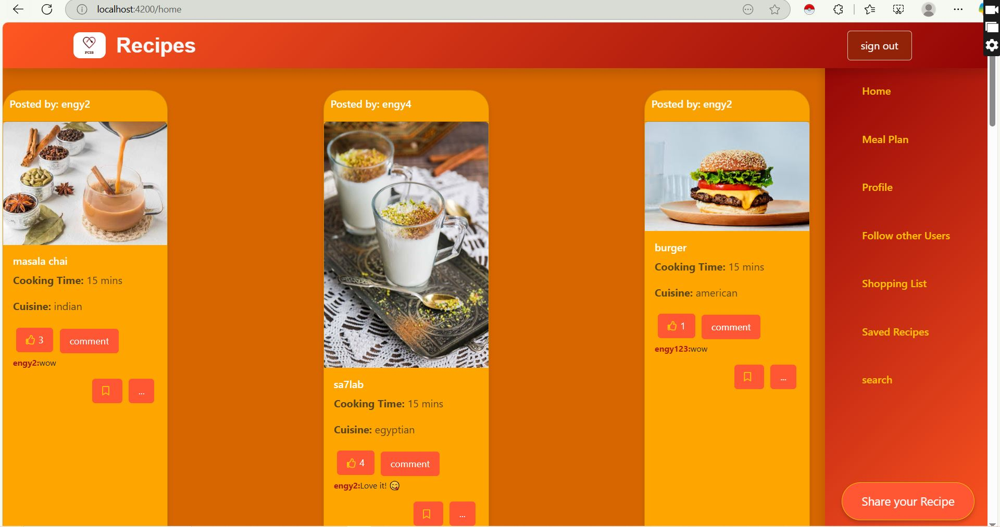

# 🍽️ Recipe & Meal Planning App

A community-based web app that lets users explore, share, and plan meals with ease. Built using Angular and Firebase, this app combines recipe discovery, social interaction, and meal organization in one place.

## 🚀 Features

- **User Authentication**
  - Register, login, and logout with Firebase Auth.
- **Recipe Discovery**
  - Browse a feed of community recipes with detailed instructions and nutritional facts.
- **User Profiles**
  - View your posted recipes, followers, and who you're following.
- **Social Interaction**
  - Like, comment, follow, and unfollow other users.
- **Recipe Posting**
  - Create and share your own recipes with images, ingredients, and steps.
- **Search & Filter**
  - Search recipes by ingredients, cooking time, or cuisine.
- **Favorites**
  - Save your favorite recipes for quick access.
- **Meal Planner**
  - Plan meals for the week—breakfast, lunch, dinner, and snacks.
- **Shopping List Generator**
  - Auto-generate a categorized shopping list based on your meal plan.
- **Ratings & Reviews**
  - Rate and review recipes to help others choose great meals.

## 🛠️ Tech Stack

- **Frontend:** Angular, Angular Material, RxJS
- **Backend:** Firebase Firestore, Firebase Authentication
- **Forms & Validation:** Reactive Forms
- **Prototyping:** Figma (or Axure RP)
- **Routing:** Angular Router

## 📦 Pages

1. **Login and register**
   
2. **Home Feed** – Recipe discovery
   
3. **Recipe Detail** – Full view of ingredients, steps, and nutrition
4. **Profile Page** – User's recipes, followers/following
   
5. **Meal Planner** – Weekly planning tool
   
   
6. **Saved Recipes** – User favorites
7. **Shopping list** – shopping list of saved resipe ingrediants
    
8. **user to follow**
   

